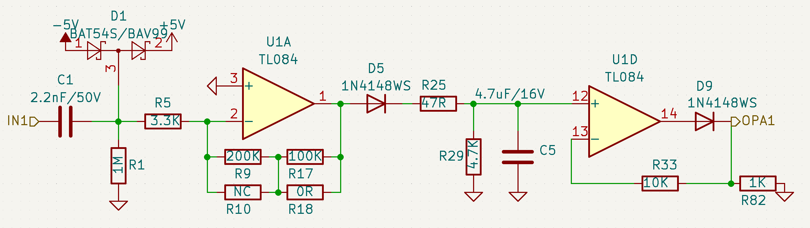
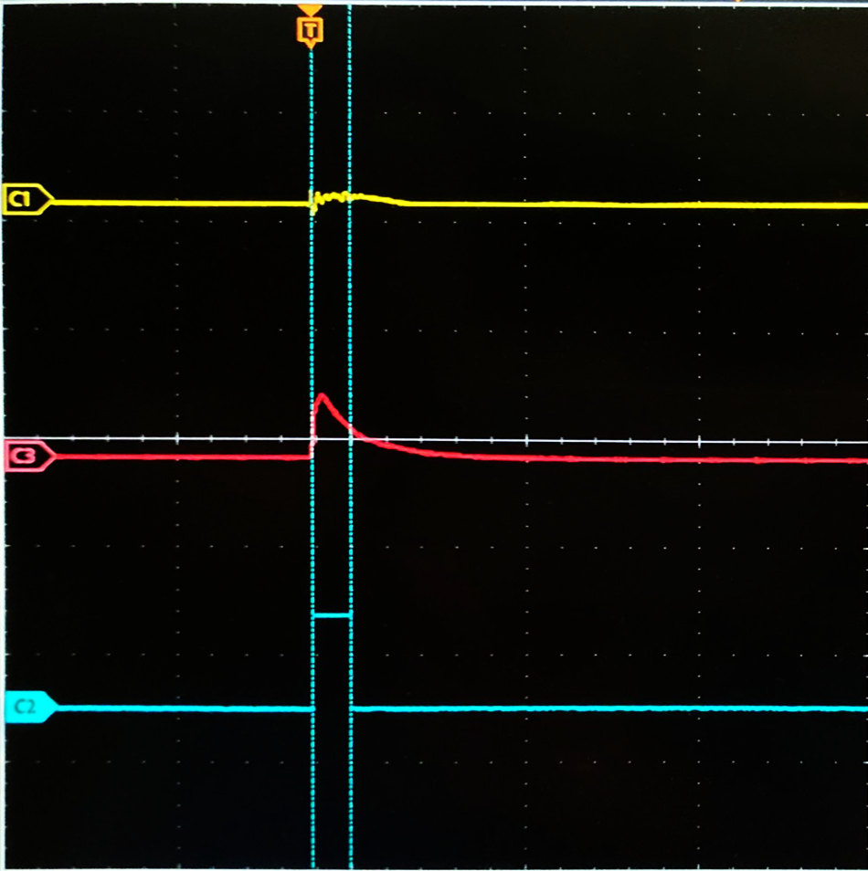
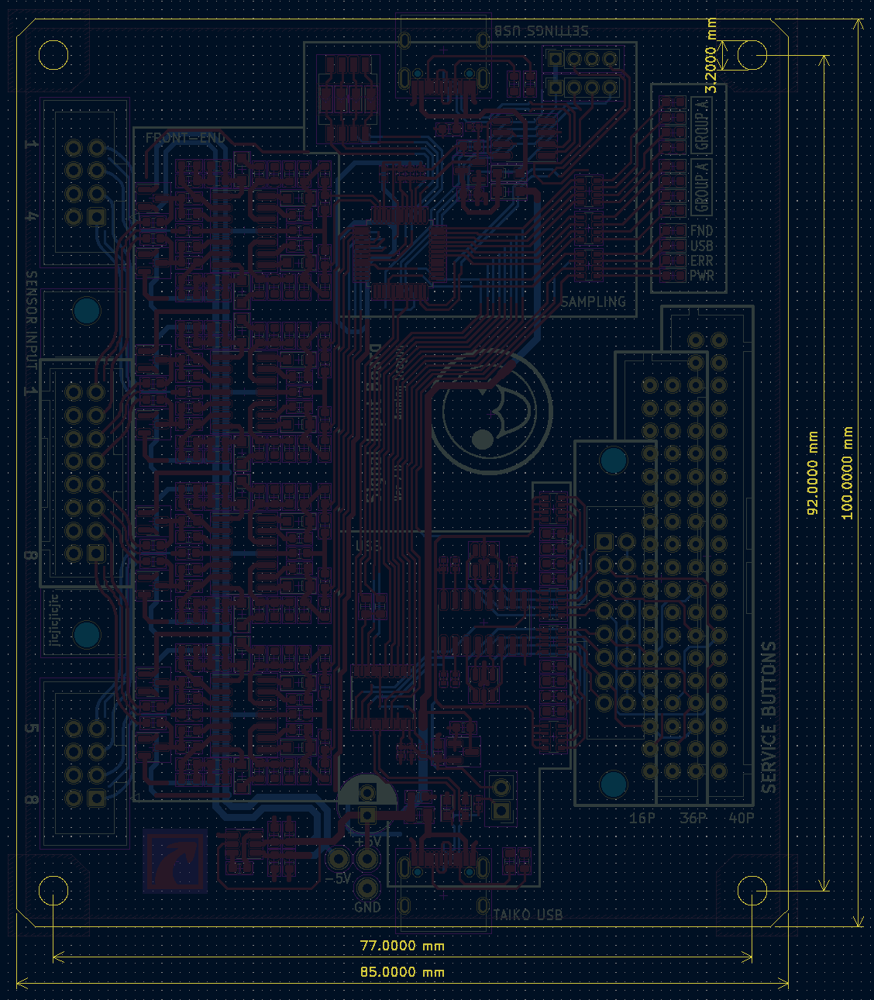
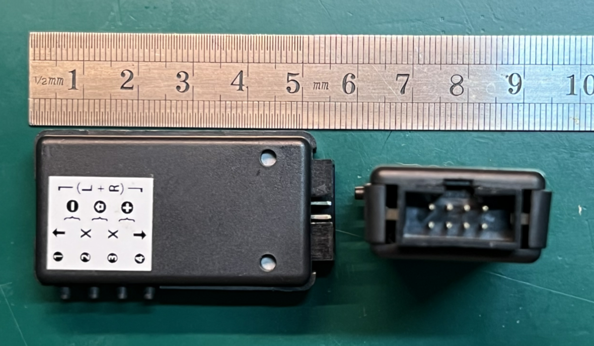
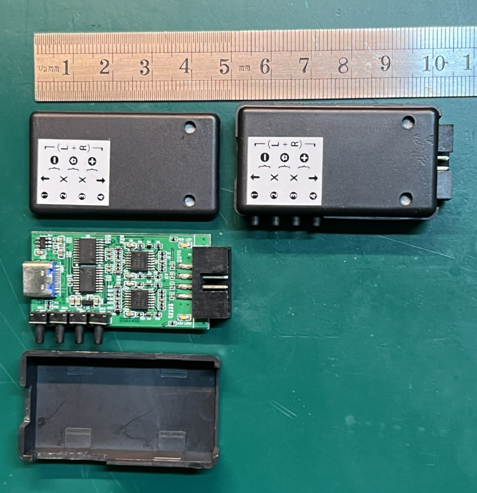

# Taiko Input 硬件

Taiko Input 硬件

分为双鼓与单鼓硬件，双鼓设计用于街机或两个鼓的场景，单鼓的硬件则是双鼓硬件简单地切去一半输入前端设计的，在硬件上两者并无很大的差异。

[English Version](./README_EN.md)  

[主页](../)  

## 硬件结构

    整体系统分为传感器（鼓）、前端、采样、USB、PC，其中前端、采样、USB三部分位于input硬件上。
    除此之外还，有电源、滤波电路等未在结构图中体现。

硬件结构  

 
## 前端电路

    前端电路采用了与SIF Board近似的设计，先进行信号的放大与积分，再限制输出。

其中一路前端电路    
  
  

信号的波形

由于来自压电传感器的信号带宽高且信号幅值小，不宜直接进行采样。前端电路将输入信号处理成便于采样的信号。  
在示波器截图中，C1(黄色)为传感器输出，C3（红色）为经过前端电路处理后的信号，C2（蓝色）为程序识别后的输出。  

 
# 硬件

    硬件分为双鼓硬件和单鼓硬件，双鼓硬件为完整版的硬件，可以用于街机环境。  
    单鼓硬件为双鼓硬件删去一半输入电路的硬件，软件上兼容了更多的单人应用场景。  

## 双鼓硬件

[硬件工程](./taiko-io/)  
[原理图](./taiko-io/new_io.pdf)  

  
双鼓的硬件3d图  

### 接口

- ① 两个单鼓输入的接口，接口定义借鉴了大力鼓（Taiko Force）。
- ② 一个双鼓的输入接口，可以焊接IDC-16P牛角连接器，或者焊接XAD连接器（B16B-XADSS-N）以兼容不同接口的双太鼓。
- ③ 配置USB接口，用于配置采样单片机。
- ④ 太鼓usb接口，插入电脑会枚举成一个USB-HID键盘设备，用于接收太鼓的数据。
- ⑤ service按键输入，焊接XAD连接器或IDC连接器，以连接不同的按键面板。其中16P接口用于自定义的连接，36P用于12亚的IO板接口，40P用于更新框体的IO板接口。可以连接最多8个接地始能的按键。
- ⑥ stm32烧录接口和配置串口。
- ⑦ CH552/CH554的boot选择开关。

 
## 单鼓硬件
[硬件工程](./taiko-io-mini/)  
[原理图](./taiko-io-mini/Taiko_input_x4.pdf)  

  
单鼓的硬件3d图  

### 接口

- 只能连接一个鼓的4路传感器，接口定义借鉴了大力鼓（Taiko Force）的接口。
- 四个按键用于启动的模式选择和其他按键。

# 装配

## 双鼓硬件

    双鼓硬件不设计外盒，借鉴街机的装配方式为使用螺柱直接装配。

  
装配尺寸图  

## 单鼓硬件

    单鼓的硬件使用了一款较通用的胶盒，可以较为方便的携带和连接。

  
装配示意图1  

  
装配示意图2  

