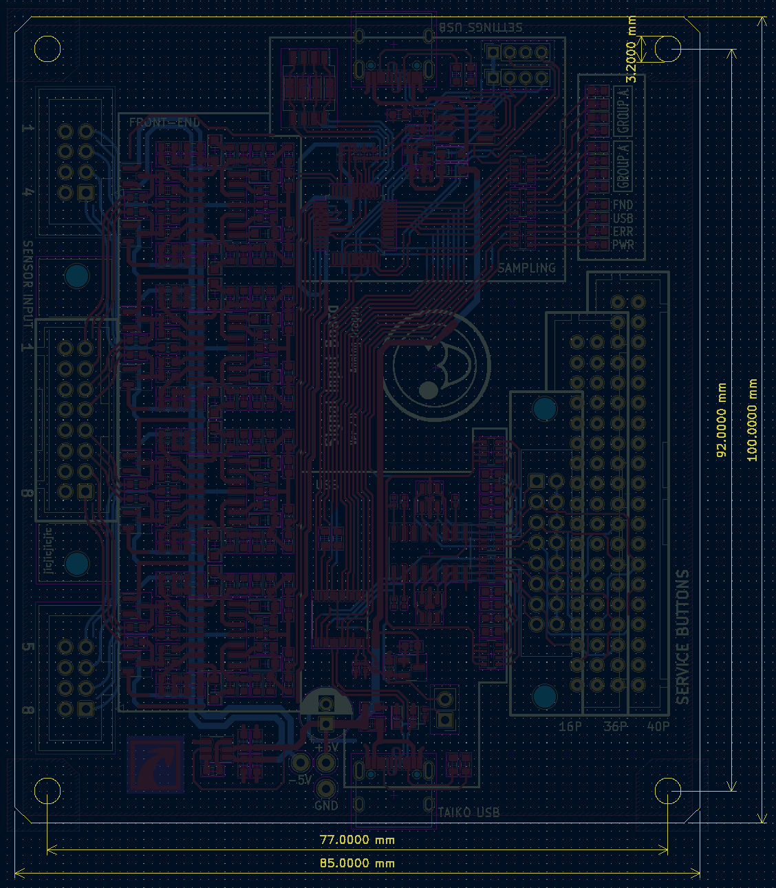
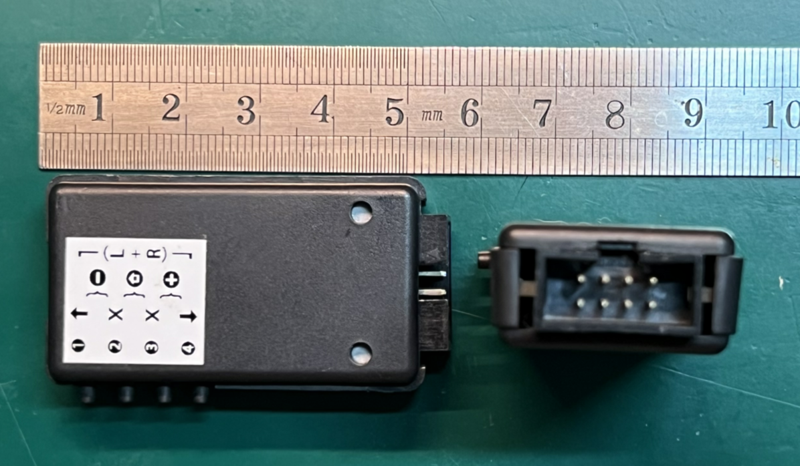
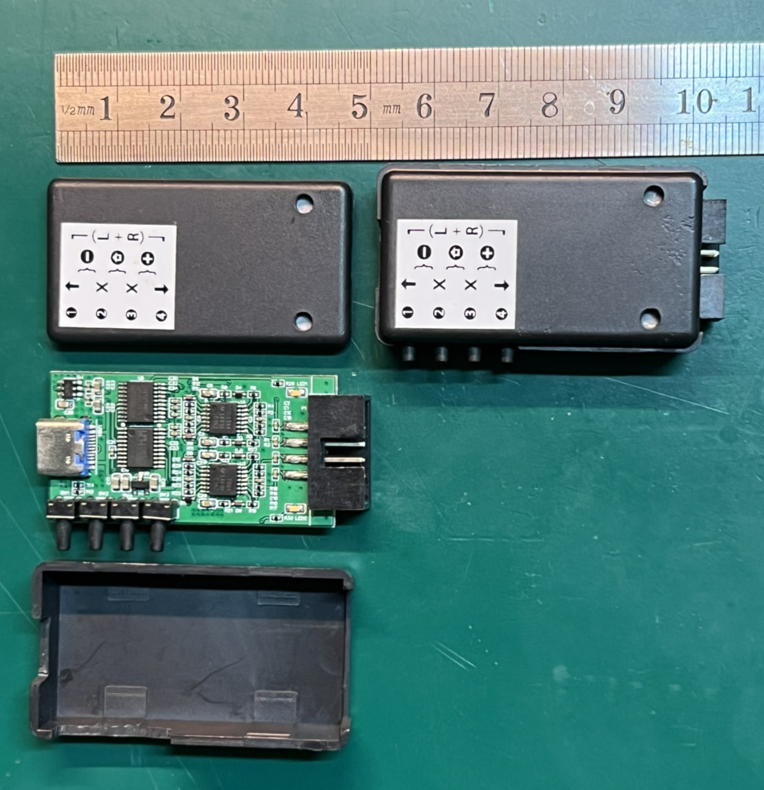

# Taiko Input Hardware

Taiko Input Hardware

There are dual taiko and single taiko hardware options. The dual taiko design is intended for arcade or two-taiko setups, while the single taiko hardware is a simplified version of the dual taiko hardware with half of the input frontend removed. There are no significant differences between the two in terms of hardware.

[中文版](./README.md)

[Home](../)

## Hardware Structure

The entire system is composed of sensors (taiko), frontend, sampling, USB, and PC. The frontend, sampling, and USB are located on the input hardware. In addition, there are other components such as power supply and filtering circuitry not shown in the structural diagram.

Hardware Structure

## Frontend Circuitry

The frontend circuitry adopts a design similar to the SIF Board, amplifying and integrating the signal before limiting the output.

One of the frontend circuitry paths

Signal waveform

Due to the high bandwidth and small signal amplitude from the piezoelectric sensors, direct sampling is not suitable. The frontend circuitry processes the input signal into a form that is suitable for sampling. In the oscilloscope screenshot, C1 (yellow) represents the sensor output, C3 (red) represents the signal after frontend processing, and C2 (blue) represents the output after program recognition.

# Hardware

The hardware consists of dual taiko hardware and single taiko hardware. The dual taiko hardware is the complete version, suitable for arcade environments. The single taiko hardware is a modified version of the dual taiko hardware with half of the input circuit removed, and it is compatible with more single-player scenarios in software.

## Dual Taiko Hardware

[Hardware Engineering](./taiko-io/)
[Schematic](./taiko-io/new_io.pdf)

3D view of dual taiko hardware

### Interfaces

- 1 Two single taiko input interfaces, with interface definitions inspired by Taiko Force.
- 2 One dual taiko input interface that can be soldered with an IDC-16P ribbon connector or an XAD connector (B16B-XADSS-N) to accommodate different interfaces of dual taiko.
- 3 Configuration USB interface for configuring the sampling microcontroller.
- 4 Taiko USB interface, when plugged into a computer, it enumerates as a USB-HID keyboard device for receiving taiko data.
- 5 Service button input, soldered with an XAD or IDC connector to connect different button panels. The 16P interface is for custom connections, 36P is for the old(12th) IO board interface(B36B-XADSS-N), and 40P is for newer the frame's IO board interface(B40B-XADSS-N). It can connect up to 8 buttons with common ground.
- 6 STM32 burning interface and configuration serial port.
- 7 CH552/CH554 boot selection switch.

## Single Taiko Hardware
[Hardware Engineering](./taiko-io-mini/)
[Schematic](./taiko-io-mini/Taiko_input_x4.pdf)

3D view of single taiko hardware

### Interfaces

- Can only connect 4-channel sensors for a single taiko, with interface definitions inspired by Taiko Force.
- Four buttons for mode selection and other functions.

# Assembly

## Dual Taiko Hardware

The dual taiko hardware does not have an external enclosure. It is assembled directly using screws, following the assembly approach commonly used in arcades.

Assembly Dimension Diagram

## Single Taiko Hardware

The single taiko hardware uses a more common and portable casing, making it easier to carry and connect.

Assembly Illustration 1  

Assembly Illustration 2  

  
tag
