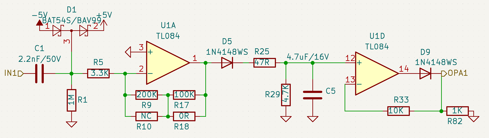
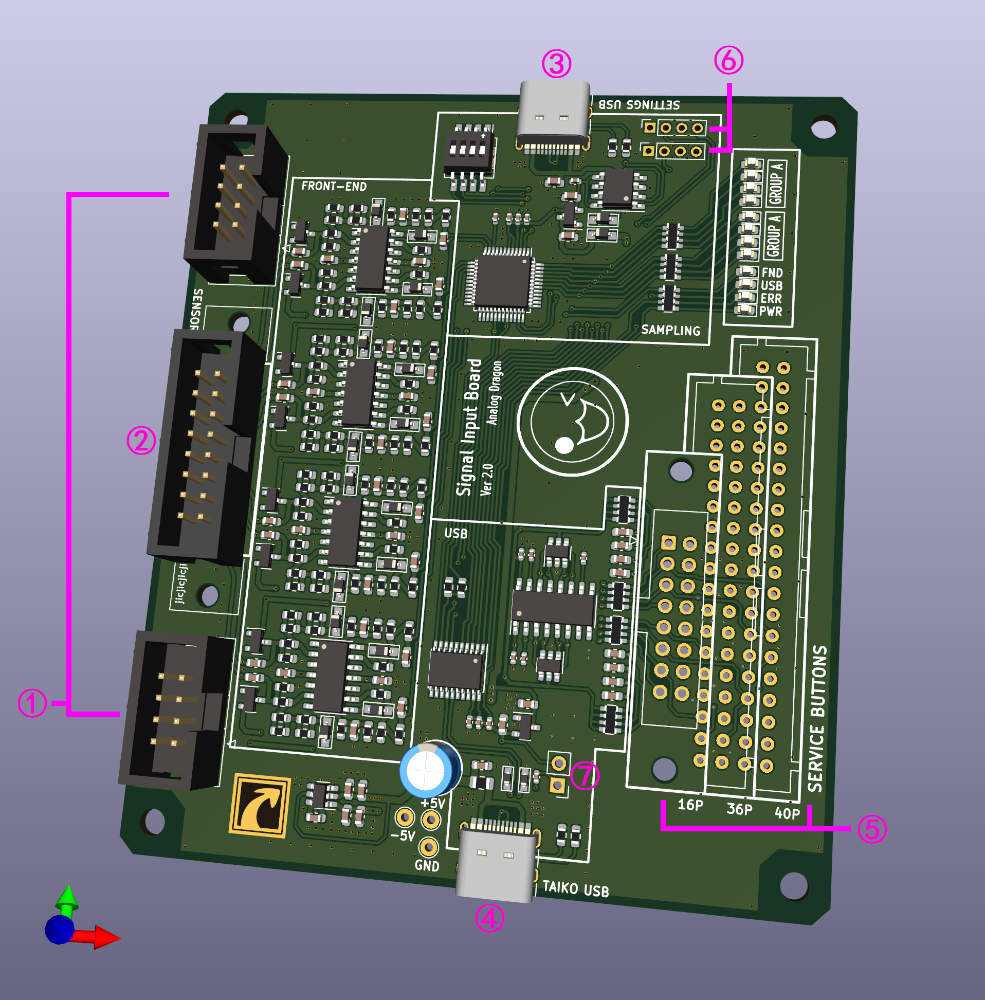

# Taiko Input Hardware

Taiko Input Hardware

There are dual drum and single drum hardware options. The dual drum design is intended for arcade or two-drum setups, while the single drum hardware is a simplified version of the dual drum hardware with half of the input frontend removed. There are no significant differences between the two in terms of hardware.

[Chinese Version](./README.md)

[Home](../)

## Hardware Structure

The entire system is composed of sensors (drums), frontend, sampling, USB, and PC. The frontend, sampling, and USB are located on the input hardware. In addition, there are other components such as power supply and filtering circuitry not shown in the structural diagram.

Hardware Structure

## Frontend Circuitry

The frontend circuitry adopts a design similar to the SIF Board, amplifying and integrating the signal before limiting the output.

One of the frontend circuitry paths

Signal waveform

Due to the high bandwidth and small signal amplitude from the piezoelectric sensors, direct sampling is not suitable. The frontend circuitry processes the input signal into a form that is suitable for sampling. In the oscilloscope screenshot, C1 (yellow) represents the sensor output, C3 (red) represents the signal after frontend processing, and C2 (blue) represents the output after program recognition.

# Hardware

The hardware consists of dual drum hardware and single drum hardware. The dual drum hardware is the complete version, suitable for arcade environments. The single drum hardware is a modified version of the dual drum hardware with half of the input circuit removed, and it is compatible with more single-player scenarios in software.

## Dual Drum Hardware

[Hardware Engineering](./taiko-io/)
[Schematic](./taiko-io/new_io.pdf)

3D view of dual drum hardware

### Interfaces

- ¢Ù Two single drum input interfaces, with interface definitions inspired by Taiko Force.
- ¢Ú One dual drum input interface that can be soldered with an IDC-16P ribbon connector or an XAD connector (B16B-XADSS-N) to accommodate different interfaces of dual drums.
- ¢Û Configuration USB interface for configuring the sampling microcontroller.
- ¢Ü Taiko USB interface, when plugged into a computer, it enumerates as a USB-HID keyboard device for receiving drum data.
- ¢Ý Service button input, soldered with an XAD or IDC connector to connect different button panels. The 16P interface is for custom connections, 36P is for the 12-pin IO board interface, and 40P is for updating the frame's IO board interface. It can connect up to 8 buttons with common ground.
- ¢Þ STM32 burning interface and configuration serial port.
- ¢ß CH552/CH554 boot selection switch.

## Single Drum Hardware
[Hardware Engineering](./taiko-io-mini/)
[Schematic](./taiko-io-mini/Taiko_input_x4.pdf)

3D view of single drum hardware

### Interfaces

- Can only connect 4-channel sensors for a single drum, with interface definitions inspired by Taiko Force.
- Four buttons for mode selection and other functions.

# Assembly

## Dual Drum Hardware

The dual drum hardware does not have an external enclosure. It is assembled directly using screws, following the assembly approach commonly used in arcades.

Assembly Dimension Diagram

## Single Drum Hardware

The single drum hardware uses a more common and portable casing, making it easier to carry and connect.

Assembly Illustration 1

Assembly Illustration 2