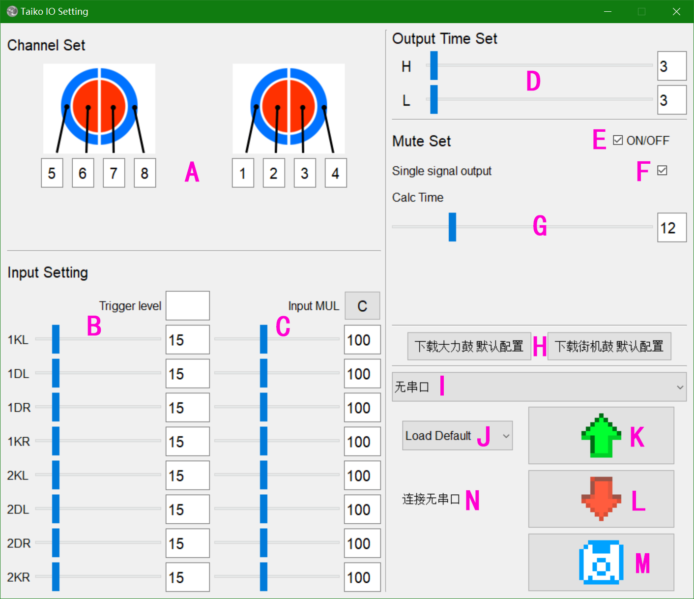

# Host Computer
    QT, WIN64
    The host computer software is used to configure the parameters of the sampling microcontroller.

[中文版](./README.md)

[Home](../)

## Instructions

Screenshot  

### Software Interface

- A-Drum sensor channel sequence configuration
- B-Input configuration-Trigger threshold (triggering is done in hardware, no obvious effect in software configuration)
- C-Input configuration-Multiplication factor (configure this when a certain sensor is exceptionally sensitive or insensitive, C for reset)
- D-Output time configuration, H for hold time when pressing, L for hold time when releasing, no response to other inputs during hold time
- E-Shielding configuration (used to calculate crosstalk caused by the physical structure of the drum)
- F-Shielding configuration-Single response (selecting this will trigger only one sensor each time)
- G-Shielding configuration-Calculate rounds (set to 0 to disable calculation, directly trigger according to the fastest speed)
- H-Some default parameters (for big drum and arcade drum)
- I-Serial port selection
- J-Select the parameter group on the upload board
- K-Upload parameter button
- L-Download parameter button (this step does not store data, data will be lost when the microcontroller is reset)
- M-Save parameter button
- N-Software status

### Configuration Process

- 1 Select the serial port, click upload, and the status will be displayed as `Success` (used to determine if the connection is successful)
- 2 Reset the preset parameters according to your needs or upload old parameters
    - For modifications based on the old parameters, select `Load Saved`, and then press the upload parameter button
    - For modifications based on the default configuration, click the desired default configuration button (the two default configurations only differ in drum mapping)
- After making modifications, click the download parameter button and confirm if the parameters are reasonable on the drum
- Click the save parameter button

## Other Instructions
- When using single drum hardware, the parameters for the second drum are meaningless
- Default configurations may have issues; you can make fine adjustments based on the default parameters to suit your drum
- The sensor wire sequence of the drum can be remapped through this host computer.