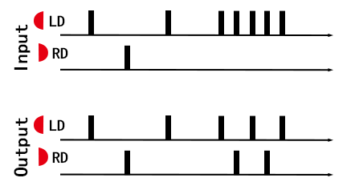

# Taiko Input

太鼓输入硬件，usb为HID设备，可以连接2个鼓和8通道的数字量输入。  
文中所提到的太鼓-虹相关的软件，皆下载自互联网。

- [English Version](./README_EN.md)


## [硬件工程](./HW/)
## [USB 单片机](./USB-MCU/)
## [采样单片机](./Sampling-MCU/)
## [上位机](./QT-APP/)
## [文档](./TEXT/)
  


## 工程结构：
```
|—— HW
    |—— taiko-io
    |—— taiko-io-mini
|—— USB-MCU
    |—— TK_usb_CH552
    |—— TK_usb_CH552_mini
|—— Sampling-MCU
    |—— 8chV3_WithCH552
|—— QT-APP
    |—— APP1_Taiko_IO_Setting
|—— TEXT
```


## HW 硬件工程

硬件工程位于此目录下。  

`taiko-io/`目录内的是双鼓的工程，可用于两个鼓的使用环境（街机），工程使用KICAD设计。  
此项目硬件包含8路模拟输入和8路数字量输入，板载配置接口，单usb供电。  

`taiko-io-mini/`目录内的是单鼓的工程，一般用于一个鼓的使用环境，工程使用LCEDA设计。  
此项目硬件包含4路模拟输入和4个按键，需要测试点配置，单usb供电。  


## USB-MCU USB单片机

USB单片机的软件工程位于此目录下。包含两个软件，根据硬件不同，适配的软件工程也不同。  
使用的单片机为 CH552/CH554，是一款USB 8位单片机。  

`TK_usb_CH552/`目录内的软件适配双鼓硬件（街机），能枚举成为一个USB-HID键盘。  

`TK_usb_CH552_mini/`目录内的软件适配单鼓硬件，可以枚举成不同的USB设备。比如说USB-HID键盘或n******o switch适用的手柄设备。  

软件使用keil 4编译，编译前根据宏可以关闭/打开相关的软件功能。  


## Sampling-MCU 采样单片机

采样单片机的软件工程位于此目录下。软件使用宏区分两款硬件。  
使用的单片机为 STM32G030。  

软件使用keil 5编译，编译前根据宏可以关闭/打开相关的软件功能，切换硬件版本。  


## QT-APP 上位机

上位机的软件工程位于此目录下。上位机可以用于配置硬件的相关参数。  

使用的UI框架为QT 5  


## TEXT 文档

一些中间文档和输出文档位于此目录下。  


# 系统框图
详见[硬件工程](./HW/)  

  
系统框图  

# 做的一些裂开设计

    主要是通过观察游戏运行的特征，去做体验上的优化。可能合理也可能不合理。

## 游戏软件运行的观察
- 输入频率限制：ns平台的游戏与虹均有输入频率限制。经过测试，每个player独立的。同一个玩家，单个通道限制最高30次每秒，四个通道一起限制60次每秒。超过这个频率的输入会被扔掉。  
也就是说如果只敲左咚或者右咚，则最多30打每秒，而如果左右咚交替输入，能提高到60打每秒。  

- ns平台本身的硬件限制：按键输入会有一个很长的滤波，且按下与松开均需要保持一段时间才能生效。  
在ns游戏内，这个一段时间需要大于20ms。但是主页上则要远大于20ms甚至要到100ms，可能是ns支持可变滤波时间。  

- 虹的数据注入：

  
## 输出交叉分配

功能实现放在了[USB 单片机](./USB-MCU/)

由于机能或软件运行方式，不同的软件支持的输入最大频率不同，分配输出主要原因是为了能使输入频率达到这台设备的上限。  
表现就是在触发频率高的时候，同一个通道的输入会分配到另一个通道，不同的设备采取的方案不相同。  
- ns：按键消抖做的比较激进，直接在有高频输入的时候，优先分配给同侧的两个按键。
- 虹：游戏软件限制了全局输入的最高频率和单个通道输入的最高频率，可能是为了方便计算图像，这边限制了单一个通道的输入频率，且将同为“咚”的输入分配给空闲的通道。
- PC的其他应用（比如说Open Taiko等）：软件没有做输入频率限制，所以不需要做分配。

  
适配虹的交叉分配示意图  

## 信号触发与串音检测

多路信号同时输入的时候，会选择触发幅值更高的通道。  
鼓的传感器被固定在几块相对独立的木板上。通常情况下，直接敲击木板得到的信号，强度是远大于受震动干扰或串扰带来的信号。  

这里的做法是，在首次触发后做微小的延时等待其他通道触发。如果在这期间有多个通道被触发，则输出这里面最强信号的通道。  


触发示意图  

    如果怎么调都会串音，需要考虑是鼓的结构导致的。检查鼓是不是传感器脱落，木板是不是调节的高度不合适等。

# 外观

详见[硬件工程](./HW/) 

## 双鼓硬件（街机/两个鼓场景）


双鼓的硬件3d图  

## 单鼓硬件（自己玩）

  
单鼓的硬件3d图  
