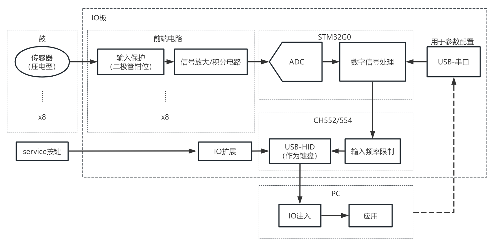

# Taiko Input

This project is an Taiko input hardware which emulates USB HID input device with max 2 of drums & 8 channel digital-input.

[CHN](./README.md)

<br/>

## [HARDWARE](./HW/)
## [USB-MCU](./USB-MCU/)
## [Analog sampling MCU](./Sampling-MCU/)
## [PC-Application](./QT-APP/)
## [FILE](./TEXT/)

<br/><br/>

## Project treeview：
```
|—— HW
    |—— taiko-io
    |—— taiko-io-mini
|—— USB-MCU
    |—— TK_usb_CH552
    |—— TK_usb_CH552_mini
|—— Sampling-MCU
    |—— 8chV3_WithCH552
|—— QT-APP
    |—— APP1_Taiko_IO_Setting
|—— TEXT
```

<br/><br/>

## HW HARDWARE

Projects of hardware is in this floder.

taiko-io/ is for two drums. Which used KICAD software to desgin.
This hardware contains 8 Analog-input & 8 Digital-input. Configure port is on-board. USB power supply OK.

taiko-io-mini/ is for only one drum. Which used KICAD software to desgin.
This hardware contains 4 Analog-input & 4 Digital-input. You should use test point to config. USB power supply OK.

<br/><br/>

## USB-MCU MCU for USB

Programs of USB-MCU is in this folder. Two folders are for different hardwares.

Please notice you should use the software matchs your hardware.

The MCU is CH552 or CH554, an 8-bit 51 MCU.

TK_usb_CH552/ is made for two drums. USB Enumeration only for HID keyboard.

TK_usb_CH552_mini/is made for single drum. USB Enumeration for HID keyboard or gamepad of n******o switch.  

This part's ompile only tested with Keil4. You can use macro settings to enable/disable some function.

<br/><br/>

## Sampling-MCU Analog sampling MCU

Programs of Sampling-MCU is in this folder.You can use macro settings to switch hardware version.

The MCU is STM32G030.

This part's ompile only tested with Keil5. You can use macro settings to enable/disable some function and switch hardware version.

<br/><br/>

## QT-APP PC Application

This folder contains PC Applications. You can config hardware paramater by this app.

The application uses QT S UI framework.

<br/><br/>

## TEXT And other files.

Some intermediate document and output files is in this folder.

<br/><br/>

# Hardware flow-chat
See [HARDWARE](./HW/)  

  
<center>HARDWARE</center>

