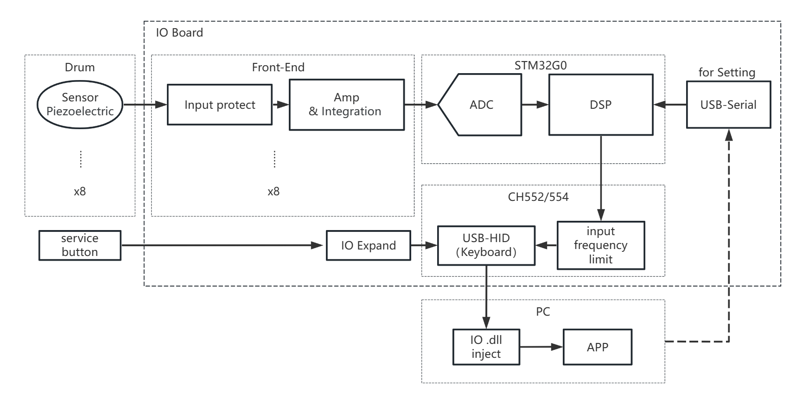

# Taiko Input

Taiko Input is a hardware device for taiko input. It is a USB HID device that can connect two taiko and has 8 channels of digital input.  
The ニジイロ software mentioned in this document is downloaded from the internet.

- [中文版](./README.md)


## [Hardware Engineering](./HW/)
## [USB Microcontroller](./USB-MCU/)
## [Sampling Microcontroller](./Sampling-MCU/)
## [PC Application](./QT-APP/)
## [Documents](./TEXT/)
  


## Project Structure:
```
|—— HW
    |—— taiko-io
    |—— taiko-io-mini
|—— USB-MCU
    |—— TK_usb_CH552
    |—— TK_usb_CH552_mini
|—— Sampling-MCU
    |—— 8chV3_WithCH552
|—— QT-APP
    |—— APP1_Taiko_IO_Setting
|—— TEXT
```


## HW Hardware Engineering

The hardware engineering files are located in this directory.  

The `taiko-io/` directory contains the project for dual taiko, suitable for the arcade environment. The project is designed using KICAD.  
This hardware project includes 8 channels of analog input, 8 channels of digital input, on-board configuration interface, and USB power supply.  

The `taiko-io-mini/` directory contains the project for a single taiko, generally used for a single taiko environment. The project is designed using LCEDA.  
This hardware project includes 4 channels of analog input and 4 buttons, must use test point to configuration, and USB power supply.


## USB-MCU USB Microcontroller

The software projects for the USB microcontroller are located in this directory. There are two software projects, each tailored to different hardware.  
The microcontroller used is CH552/CH554, which is an 8-bit USB microcontroller.  

The `TK_usb_CH552/` directory contains software adapted for the dual taiko hardware (arcade), which can be enumerated as a USB-HID keyboard.  

The `TK_usb_CH552_mini/` directory contains software adapted for the single taiko hardware, capable of being enumerated as different USB devices, such as USB-HID keyboard or n******o switch compatible gamepad.  

The software is compiled using Keil 4, and relevant software functionality can be enabled/disabled based on macros before compilation.  


## Sampling-MCU Sampling Microcontroller

The software projects for the sampling microcontroller are located in this directory. The software uses macros to differentiate between two hardware models.  
The microcontroller used is STM32G030.  

The software is compiled using Keil 5, and relevant software functionality can be enabled/disabled based on macros before compilation, allowing for switching between hardware versions.  


## QT-APP PC Application

The software project for the PC application is located in this directory. The PC application is used to configure the hardware parameters.  

The UI framework used is QT 5.  


## TEXT Documents

Some intermediate and output documents are located in this directory.  


# System Diagram
Refer to [Hardware Engineering](./HW/) for details.  

  
System Diagram  

# Some Interesting Designs

    The main focus is on optimizing the gaming experience by observing the characteristics of game operation. 
    It may or may not be reasonable.

## Observation of Game Software Operation
- Input Frequency Limitation: Both the ns platform games and ニジイロ have input frequency limitations. After testing, each player has independent limitations. For the same player, a single channel can have a maximum limit of 30 inputs per second, while all four channels together are limited to 60 inputs per second. Inputs exceeding this frequency will be discarded.  
This means that if only left or right taiko hits are played, a maximum of 30 hits per second can be achieved. However, if left and right taiko hits are alternated, it can be increased to 60 hits per second.

- Hardware Limitations of the ns Platform: Key inputs have a long debouncing time, and both pressing and releasing the keys need to be held for a certain period to take effect.  
Within an ns game, this period needs to be greater than 20ms. However, on the home screen, it needs to be much greater than 20ms, even up to 100ms, which may be due to variable filtering time supported by the ns.

- Data Injection for ニジイロ:

## Cross-Channel Output Allocation

The implementation of this feature is located in the [USB microcontroller](./USB-MCU/).

Due to different device capabilities or software running methods, different software support different maximum input frequencies. The purpose of allocating the output channels is to achieve the input frequency limit of the particular device.  
The behavior observed is that when the triggering frequency is high, inputs from the same channel will be allocated to another channel. Different devices adopt different approaches:
- ns: Aggressive debouncing is performed, and when there are high-frequency inputs, they are allocated primarily to the two adjacent keys on the same side.
- ニジイロ: The game software limits the maximum global input frequency and the maximum input frequency for a single channel. This may be for the convenience of calculating images. Here, the input frequency for a single channel is limited, and inputs of the same type (e.g., "dong") are allocated to idle channels.
- Other applications on PC (such as Open Taiko): These software programs do not have input frequency limitations, so no allocation is needed.


Diagram showing cross-channel allocation designed for ニジイロ.

## Signal Triggering and Crosstalk Detection

When multiple signals are input simultaneously, the channel with the higher amplitude is selected for triggering.  
Taiko sensors are fixed on several relatively independent wooden boards. In general, direct strikes on the boards produce signals with much higher intensity compared to signals affected by vibration or crosstalk.

The approach here is to introduce a small delay after the first trigger and wait for other channels to trigger. If multiple channels are triggered during this period, the channel with the strongest signal is output.


Illustration of the triggering process.

    If crosstalk occurs no matter how it is adjusted, the taiko's structure needs to be considered. Check if any sensors have come loose or if the height adjustment of the wooden boards is appropriate.

# Appearance

Refer to [Hardware Engineering](./HW/) for details.

## Dual Taiko Hardware (Arcade/Two Taiko Scene)


3D rendering of the dual taiko hardware.

## Single Taiko Hardware (For Personal Use)


3D rendering of the single taiko hardware.
