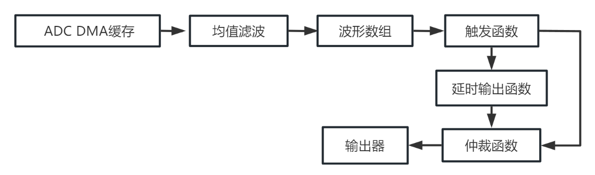
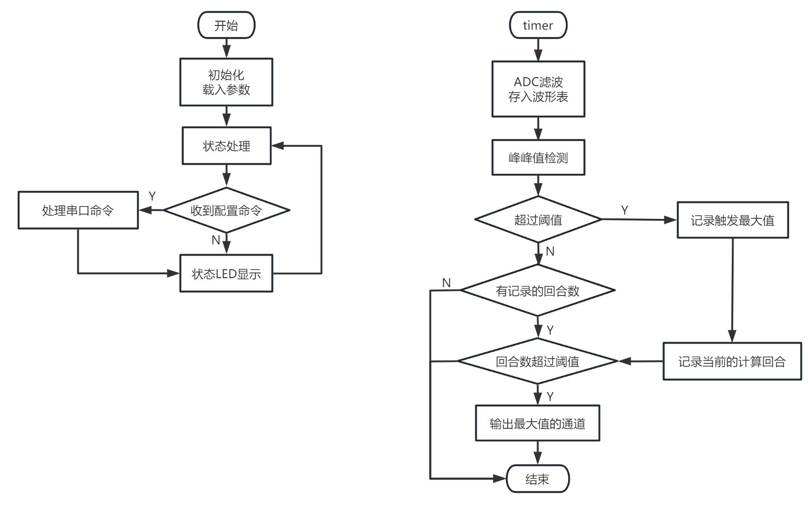

# Sampling MCU工程
    采样单片机软件
    MCU：stm32g030，IDE：KEIL 5

[EN](./README_EN.md)  

[主页](../)  

<br/>

## 双鼓版本与单鼓版本

根据/main.h/内的宏区分软件双鼓与单鼓硬件。  
值得注意的是编译为单鼓的软件放在双鼓的硬件上是不能使用的，原因是初始化不相同。  

单鼓版本：
```
…
#define IS_4CH_MODE 
…
```

双鼓版本：
```
…
//#define IS_4CH_MODE 
…
```
<br/>

## 数字信号处理

数字信号处理主要需要处理触发、消抖和判断是否信号串扰。  
由于鼓是包含物理结构的，震动的串扰可以导致信号被误触发。所以需要对同一时间收到的信号进行判断再输出。

### 软件处理框图


<center>数据流向图</center>

信号被采样后，记录成一个波形数组，通过触发函数来判断是否有符合预期强度的信号。  
通过延时输出来确保信号到来时，不会漏掉其他传感器的触发。当有其他通道在延时期间被触发，则也会记录被触发的值。  
仲裁函数用来判断延时这段时间内，被触发的几个通道中强度最大的值。同时用于复位其他函数的状态。  
输出的信号由输出器输出给USB单片机。  

<br/>

## 软件流程图


<center>数据流向图</center>

软件可以配置为速度优先触发或峰值最大触发。  
回合数越大，则计算的周期越长，当回合数设置为0时，则以速度优先的方式进行触发。  

<br/>

## 配置采样参数

采样参数通过上位机配置  

[上位机软件](../QT-APP/)  

<br/>

## 数据输出

数据通过USB单片机发送给电脑  

[USB MCU软件](../USB-MCU/)  
