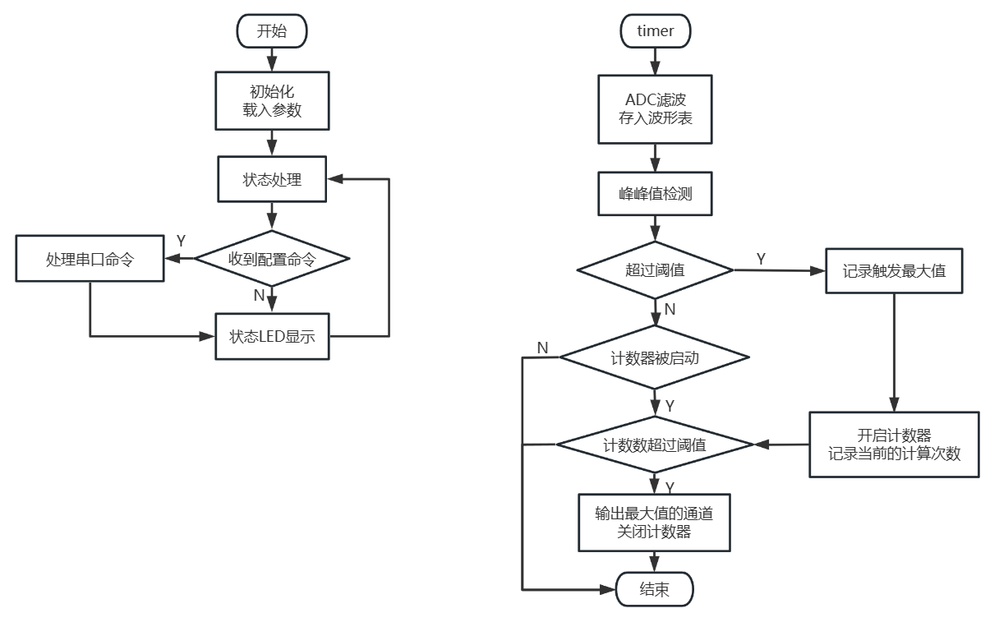

# Sampling MCU工程
    采样单片机软件
    MCU：stm32g030，IDE：KEIL 5

[English Version](./README_EN.md)  

[主页](../)  


## 双鼓版本与单鼓版本

根据/main.h/内的宏区分软件双鼓与单鼓硬件。  
值得注意的是编译为单鼓的软件放在双鼓的硬件上是不能使用的，原因是初始化不相同。  

单鼓版本：
```
…
#define IS_4CH_MODE 
…
```

双鼓版本（注释这一行代码）：
```
…
//#define IS_4CH_MODE 
…
```


## 数字信号处理

数字信号处理主要需要处理触发、消抖和判断是否信号串扰。  
由于鼓是包含物理结构的，震动的串扰可以导致信号被误触发。所以需要对同一时间收到的信号进行判断再输出。  

### 处理框图


数据流向图  

信号被采样后，记录成一个波形数组，通过触发函数来判断是否有符合预期强度的信号。  
通过延时输出来确保信号到来时，不会漏掉其他传感器的触发。当有其他通道在延时期间被触发，则也会记录被触发的值。  
仲裁函数用来判断延时这段时间内，被触发的几个通道中强度最大的值。同时用于复位其他函数的状态。  
输出的信号由输出器输出给USB单片机。  


### 信号触发与串音检测

多路信号同时输入的时候，会选择触发幅值更高的通道。  
鼓的传感器被固定在几块相对独立的木板上。通常情况下，直接敲击木板得到的信号，强度是远大于受震动干扰或串扰带来的信号。  

这里的做法是，在首次触发后做微小的延时等待其他通道触发。如果在这期间有多个通道被触发，则输出这里面最强信号的通道。  


触发示意图  


## 软件流程图


数据流向图  

软件可以配置为速度优先触发（周期设置为0）或峰值最大触发。  
回合数越大，则计算的周期越长，当回合数设置为0时，则以速度优先的方式进行触发。  


## 配置采样参数

采样参数通过上位机配置  

[上位机软件](../QT-APP/)  


## 数据输出

数据通过USB单片机发送给电脑  

[USB MCU软件](../USB-MCU/)  
