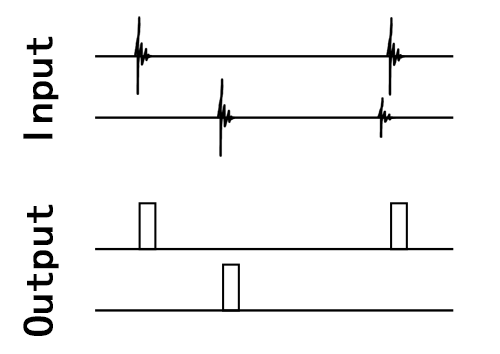

# Sampling MCU Project
    Sampling Microcontroller Software
    MCU: stm32g030, IDE: KEIL 5

[中文版](./README.md)  

[Home](../)  


## Dual Taiko Version and Single Taiko Version

Differentiate the software between dual taiko and single taiko hardware using macros in /main.h/.  
It is important to note that the software compiled for single taiko hardware cannot be used on dual taiko hardware due to differences in initialization.  

Single Taiko Version:
```
...
#define IS_4CH_MODE 
...
```

Dual Taiko Version (comment out this line of code):
```
...
//#define IS_4CH_MODE 
...
```


## Digital Signal Processing

Digital signal processing mainly involves trigger handling, debouncing, and determining if there is signal crosstalk.  
Since the taiko contains a physical structure, vibrations can cause signal misfires. Therefore, it is necessary to determine and output the signals received at the same time.  

### Processing Flowchart


Data flow diagram  

After the signal is sampled, it is recorded as a waveform array, and a trigger function is used to determine if there is a signal with the expected strength.  
The delayed output ensures that when a signal arrives, it does not miss the trigger of other sensors. If other channels are triggered during the delay, the triggered values will also be recorded.  
The arbitration function determines the maximum strength among the triggered channels during the delay, and then reset the states of other functions.  
The output signal is sent to the USB microcontroller by the output device.  


### Signal Triggering and Crosstalk Detection

When multiple signals are input simultaneously, the channel with the higher amplitude will be triggered.  
The taiko sensors are fixed on several relatively independent boards. Typically, the signal obtained by directly striking the board has a much higher strength than the signals caused by vibration interference or crosstalk.  

The approach here is to wait for a small delay after the initial trigger to allow other channels to trigger. If multiple channels are triggered during this period, then the channel with the strongest signal among them is output.  


Triggering illustration  


## Software Flowchart


Data flow diagram  

The software can be configured for speed-priority triggering (setting the period to 0) or maximum peak triggering.  
The longer the number of cycles, the longer the calculated period. When the number of cycles is set to 0, triggering is performed in a speed-priority manner.  


## Configuring Sampling Parameters

Sampling parameters are configured through the upper computer software  

[Upper Computer Software](../QT-APP/)  


## Data Output

Data is sent to the computer using a USB microcontroller  

[USB MCU Software](../USB-MCU/)
