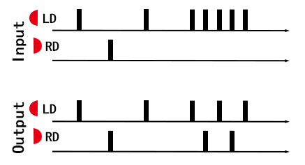

# USB-MCU工程

[English Version](./README_EN.md)  

[主页](../)  

MCU：CH552，IDE：KEIL 4  
单片机官网：[沁恒CH552](https://www.wch.cn/products/CH552.html)  


## 软件流程
软件按照如下流程运行  

```
输入 -> 输出频率限制 -> 分配输出 -> 键值映射 -> USB
```


### 输出频率限制
对输出进行频率限制主要是因为接收数据的硬件或程序，收到了超过其处理能力的数据时，会产生丢包的现象。  
经过多次测试，虹的软件输入限制为所有通道输入频率最高为60Hz，相同颜色的信号最高为30Hz。  
n******o switch限制输入信号的时间为20ms（按下与抬起都为20ms左右，小于这个值可能会导致输入与上一个输入粘连）  
其他电脑上运行的自治软件，通常无这方便的限制，但是在选择页面会有10ms左右的滤波。  


### 分配输出
由于机能或软件运行方式，不同的软件支持的输入最大频率不同，分配输出主要原因是为了能使输入频率达到这台设备的上限。  
表现就是在触发频率高的时候，同一个通道的输入会分配到另一个通道，不同的设备采取的方案不相同。  
- ns：按键消抖做的比较激进，直接在有高频输入的时候，优先分配给同侧的两个按键。
- 虹：游戏软件限制了全局输入的最高频率和单个通道输入的最高频率，可能是为了方便计算图像，这边限制了单一个通道的输入频率，且将同为“咚”的输入分配给空闲的通道。
- PC的其他应用（比如说Open Taiko等）：软件没有做输入频率限制，所以不需要做分配。  


  
适配虹的交叉分配示意图  


### 键值映射
- 双鼓硬件，鼓的输入映射为键盘输入的DFJK ZXCV，服务按键映射为键盘输入的12345678。
- 单鼓硬件，分为ns和键盘输入，其中ns输入键位见下图，键盘输入可以通过按键设置为DFJK或ZXCV，默认为DFJK。

  
单鼓硬件的标签  


## 程序的修改


### 双鼓软件

- 关闭分配输出功能，则需修改将位于`CompatibilityHID.C`内的宏`WITHOUT_OUTPUT_ASSIGN`取消注释。
- 修改输出频率限制相关的参数，修改位于`CompatibilityHID.C`内的宏`EXCHANGE_DATA`。
- 修改键值，则修改位于`CompatibilityHID.C`内的`Enp2BlukIn`函数的数组。


### 单鼓软件
单鼓软件内，集成了三种模式，分别是ns模式（借用了HORI的PID/VID，ns只校验了PID/VID，没做其他加密），适配虹的键盘模式（输出锁60Hz输入），适配其他太鼓软件的键盘模式（解锁限制并关闭分配输出）三种。  

- 修改`CompatibilityHID.C`内的宏`MODE_STARTUP`，则可以修改启动时候默认的模式。  
- 启动前1s内按如下按键，则可以切换模式
```
...
if(!KEY1)start_up_mode = MODE_NS_GP;
if(!KEY2)start_up_mode = MODE_KEYBOARD;
if(!KEY3)start_up_mode = MODE_KB_LMT;
if(!KEY4)start_up_mode = MODE_STARTUP;
...
```
- 运行时，按住1~4所有的按键，则可以进行复位，以重新切换模式。

