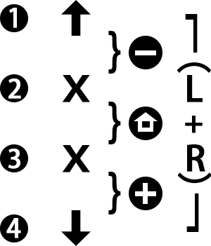

# USB-MCU Project

[中文版](./README.md)  

[Homepage](../)  

MCU: CH552, IDE: KEIL 4  
Microcontroller's official website: [WCH CH552](https://www.wch.cn/products/CH552.html)  


## Software Flow
The software runs according to the following flow:

```
Input -> Output Frequency Limitation -> Output Assignment -> Key Mapping -> USB
```


### Output Frequency Limitation
The output frequency limitation is mainly due to the hardware or program that receives the data. When it receives data that exceeds its processing capability, packet loss may occur.  
After multiple tests, the software input limitation for ニジイロ is a maximum input frequency of 60Hz for all channels and 30Hz for signals of the same color.  
The n******o switch limits the input signal time to 20ms (both press and release are around 20ms; values smaller than this may result in sticky inputs).  
Other software running on different computers usually doesn't have this convenient limitation, but there is usually a filtering of around 10ms on the selection page.  


### Output Assignment
Due to different functionalities or software operation modes, different software supports different maximum input frequencies. Output assignment is mainly used to make the input frequency reach the upper limit of the device.  
The behavior is that when the triggering frequency is high, the input of the same channel will be assigned to another channel. Different devices adopt different approaches.  
- For NS: The key debouncing is relatively aggressive. When there is a high-frequency input, it will be assigned to the two adjacent keys on the same side.
- For ニジイロ: The gaming software limits the maximum global input frequency and the maximum input frequency per channel. This may be for easier image calculations. Here, the input frequency for each channel is also limited, and inputs that have the same sound are assigned to idle channels.

  
Cross assignment diagram for compatibility with ニジイロ  


### Key Mapping
- For dual-drum hardware, drum inputs are mapped to keyboard inputs DFJK ZXCV, and service key inputs are mapped to keyboard inputs 12345678.
- For single-drum hardware, there are two modes: NS mode and keyboard mode. For NS mode, the input keys are shown in the image below. For keyboard mode, you can set the inputs as DFJK or ZXCV through the buttons, with DFJK being the default.

  
Tags for single-drum hardware  


## Modifying the Program


### Dual-drum Software

- To disable the output assignment feature, modify the `WITHOUT_OUTPUT_ASSIGN` macro inside `CompatibilityHID.C` by uncommenting it.
- To modify the parameters related to output frequency limitation, modify the `EXCHANGE_DATA` macro inside `CompatibilityHID.C`.
- To change the key values, modify the array inside the `Enp2BlukIn` function in `CompatibilityHID.C`.


### Single-drum Software
The single-drum software integrates three modes: NS mode (using HORI's PID/VID, where NS only verifies the PID/VID without any further encryption), keyboard mode compatible with ニジイロ (60Hz input lock), and keyboard mode compatible with other taiko drum software (unlock the limitations and disable the output assignment).

- To change the default startup mode, modify the `MODE_STARTUP` macro inside `CompatibilityHID.C`.
- To switch modes during startup within 1 second, use the following button combinations:
```
...
if(!KEY1)start_up_mode = MODE_NS_GP;
if(!KEY2)start_up_mode = MODE_KEYBOARD;
if(!KEY3)start_up_mode = MODE_KB_LMT;
if(!KEY4)start_up_mode = MODE_STARTUP;
...
```
- During runtime, holding down buttons 1 to 4 will trigger a reset, allowing you to switch modes again.